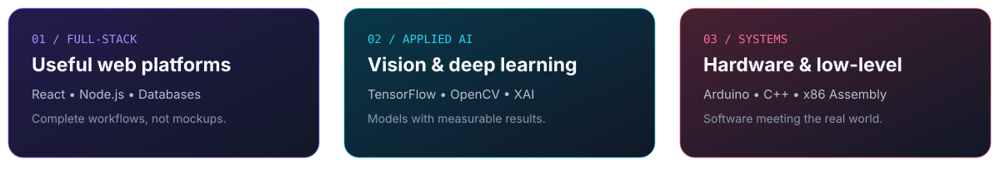

<!-- GitHub profile README for github.com/Aurpo-001 -->

  

  

  

    
    
    
  

  <i>"Build useful things. Understand how they work. Document them clearly."</i>

 

## About

I am **Tanvir Bashar Aurpo**, a Computer Science and Engineering student at **BRAC University**. I like building complete, usable systems—not isolated demos—and I enjoy moving between full-stack development, applied AI, graphics, embedded hardware, and low-level programming.

  
  

- **Learning:** compiler design, networks, databases, computer vision, and software engineering.
- **Building:** practical web platforms, research prototypes, graphics projects, and embedded systems.
- **Working style:** clear interfaces, maintainable code, honest documentation, and reproducible results.

## Currently building

  

## Tech stack

**Languages**

**Frontend**

**Backend & data**

**AI, graphics & hardware**

**Tools & platforms**

## GitHub stats

  
  
  

  <picture>
    <source media="(prefers-color-scheme: dark)" srcset="https://streak-stats.demolab.com?user=Aurpo-001&hide_border=true&background=00000000&ring=A78BFA&fire=FF6B8A&currStreakLabel=22D3EE&sideLabels=C9D1D9&dates=8B949E&currStreakNum=F0F6FC&sideNums=F0F6FC">
    
  </picture>

## Contribution graph

<picture>
  <source media="(prefers-color-scheme: dark)" srcset="https://github-readme-activity-graph.vercel.app/graph?username=Aurpo-001&bg_color=00000000&color=C9D1D9&line=A78BFA&point=22D3EE&area=true&area_color=7C3AED&hide_border=true">
  
</picture>

## Contribution snake

<picture>
  <source media="(prefers-color-scheme: dark)" srcset="https://raw.githubusercontent.com/Aurpo-001/Aurpo-001/output/github-contribution-grid-snake-dark.svg">
  
</picture>

## Featured repositories

| Project | What it demonstrates | Stack |
|---|---|---|
| [Seeing Beyond the Fake](https://github.com/Aurpo-001/Seeing-Beyond-the-Fake-Detecting-Deepfakes-Using-Deep-Learning-Based-Computer-Vision) | Spatial-temporal deepfake detection with explainability | `Python` `TensorFlow` `CNN-BiLSTM` |
| [TenantHub](https://github.com/Aurpo-001/TenantHub) | Campus rental discovery and property management | `React` `Node.js` `MongoDB` |
| [3D Rubik's Cube Simulator](https://github.com/Aurpo-001/3d-rubiks-cube-simulator) | Interactive 2x2, 3x3, and 4x4 cube simulation | `Python` `PyOpenGL` |
| [Smart Pill Dispenser](https://github.com/Aurpo-001/Smart-Pill-Dispenser) | Offline medication scheduling and hardware alerts | `Arduino` `C++` `RTC` |
| [Airport Boarding Manager](https://github.com/Aurpo-001/airport-boarding-manager-assembly) | Complete DOS airport workflow | `x86 Assembly` `DOSBox-X` |
| [University Discovery Portal](https://github.com/Aurpo-001/CSE_370_Project) | Database-backed university discovery and advising | `PHP` `MySQL` `SQLite` |

 

  <b>Open to interesting software, research, and student collaborations.</b>
    
  
  
    
  

